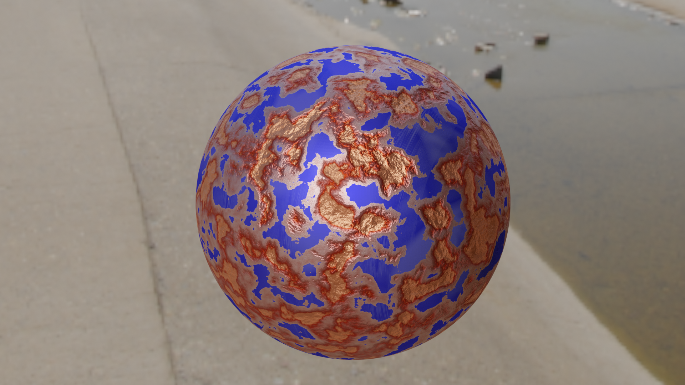

### Blender - Vliv počasí na materiál - Degradace kovu
* Semestrální práce na téma vliv počasí na materiál. Plugin je zaměřený na implementaci degradace kovu rzí. Ovšem vzhledem k tomu, že se jedná o pricipiální materiál a povahu jeho implementace, 
je velmi snadné ho upravit pro degradaci i jiných materiálů než pouze kovu. Plugin přidá degradační node group do aktivního materiálu otevřeného v node editoru.

* Dokumentace k práci najdete [zde](metalDegradation.adoc)
