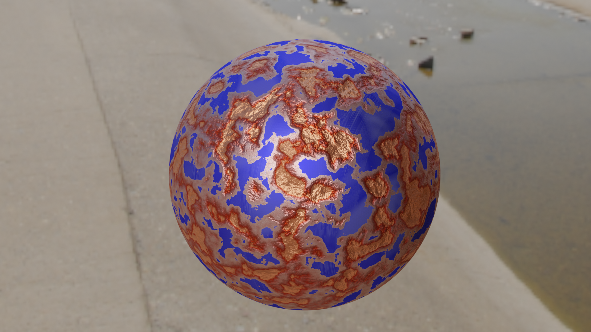

:toc:

= Metal Degradation plugin
# Plugin ke stažení
xref:metal_degradation.py#[metal_degradation.py]

## Instalace
* Stáhněte si plug-in a nainstalujte ho v Bledenru v menu ```user preferences > add-ons > install addon from file``` zde vyberte plug in file a potvrďte tlačítkem install.


## Použití pluginu
* Po nainstalování pluginu, se v ```Node Editor > Side Panel``` objeví záložka *Metal Degradation*


# Základní nastavení
* Nastavení základních parametrů pro tvorbu koroze v *Corrosion* nodu:
    ** `Crack height` - _výška děr vytvořených korozí_
    ** `Crack size` - _členitost děr vytvořených korozí_
    ** `Bumpiness` - _stupeň hrbolatosti celého povrchu_
* Nastavení intenzity poškození v *Metal wear mixer* nodu: 
    ** `Degradation` - _uživatelem zadaná hodnota celkové míry poškození objektu_

# Popis a Princip Fungování
* Aplikování metal degradtion pluginu se do node networku materiálu právě zvoleného objektu přidá *metal degradation network*. Pokud materiál již má nejěký shader, metal degradation network se automaticky
do něj začlení. Pokud ovšem žádný shader není přítomen, bude vložen jednoduchý *Glossy BSDF shader* s defaultní barvou nastavenou na `modrou`.
* Přidaný *metal degradation network* se skládá z následujících částí:
    ** `Corrosion group node` - _skupina nodu vytvářející korozi materiálu_
    ** `Metal wear group node` - _skupina nodu vytvářející ošoupání a poškrábání současného materialu_
    ** `Metal wear mixer group node` - _skupina nodu, která vypočítá poměr zastoupní degradačních shaderů a původního shaderu_
    ** `Mix shader nody` - _node na kombinaci dvou shaderů https://docs.blender.org/manual/en/latest/render/shader_nodes/converter/color_ramp.html[*Mix shader node*]_

* Průběh vytvoření výsledného shaderu vypadá následovně.
    ** Vytvoření shaderu koroze
    ** Vytvoření shaderu poškrábání
    ** Výpočet koeficientu pro poměr zastoupení jedtlivých typů poškození
    ** Mix půbovodního shaderu s shaderem poškrábání
    ** Mix výstupního shaderu z prvního mixu s shaderem koroze 


## Corrosion node group


* Skupina nodu implementující korozi materiálu. Rozbijí povrch materialů pomocí bump map a přidává barevné zabarvení v poškozených oblastech
* Vstupní node `group_input` s parametry:
    ** `Crack height` - _výška děr vytvořených korozí_
    ** `Crack size` - _členitost děr vytvořených korozí_
    ** `Bumpiness` - _stupeň hrbolatosti celého povrchu_
* Výstupní node `output_node` s parametry:
    ** `CorrosionShader` - _výstupní shader zkorodovaného materialu_
    ** `Color` - _barevná hodnota noise textury určující míru koroze v dané oblasti_

* Skupina nodu pro korozi je rozdělena do dvou hlavních podskupin
    ** Úprava celkového povrchu 
    ** Úprava oblastí s velkým poškozením 


### Oblasti velkého poškození
* Nody z této sekce mají na starost vytvoření větších deformací způsobených korozí. Výsledkem budou hlubší díry v materialu společně se zabarvením typickým pro rez.
* https://docs.blender.org/manual/en/latest/render/shader_nodes/textures/noise.html[*Noise texture*] node namapujeme na objekt pomocí https://docs.blender.org/manual/en/latest/render/shader_nodes/vector/mapping.html[*Mapping*] 
nodu a https://docs.blender.org/manual/en/latest/render/shader_nodes/input/texture_coordinate.html[*Texture Coordinate*] nodu. Pro obecné použití chceme, aby rez byla po materialu rozprostřena rovnoměrně. Proto jako vstupní `vector` parametr do https://docs.blender.org/manual/en/latest/render/shader_nodes/vector/mapping.html[*Mapping*]
nodu použijeme výstupní parametr `object` v https://docs.blender.org/manual/en/latest/render/shader_nodes/input/texture_coordinate.html[*Texture Coordinate*] nodu. 
* Parametry namapované noise textury je možné upravit pomocí parametrů, dle libosti. Nejvetší vliv na výsledek má parametr `scale` jehož hodnota je převzaná ze *Group input* nodu. Tento parametr ovlivnuje členitos/velikost jednotlivých
vytvořených děr.
* Pomocí spodního https://docs.blender.org/manual/en/latest/render/shader_nodes/converter/color_ramp.html[*Color ramp*] nodu určíme, v jakých oblastech bude docházet k deformaci porvchu. 
Tento node nám tranformuje hodnotu míry poškození v daném místě. Pokud se vstupní hodnoty budou přibližovat 0 tím hlubší díry budou.
Naopak pokuď se bude přibližovat k hodnotě 0.5, poškození bude čím dál tím menší. Po překročení hodnoty 0.5 nebude docházet k žádným změnám. Samotná aplikace děr na materiál je provedena pomocí https://docs.blender.org/manual/en/latest/render/shader_nodes/vector/bump.html[*Bump*] nodu.
napojeného a výstup ze spodního https://docs.blender.org/manual/en/latest/render/shader_nodes/converter/color_ramp.html[*Color ramp*] nodu.
* Vrchní https://docs.blender.org/manual/en/latest/render/shader_nodes/converter/color_ramp.html[*Color ramp*] node bude vytvářet zabarvení jednotlivých obalstí. Pro simulaci rzi použijeme odstíny oranžové až hnědé. 
https://docs.blender.org/manual/en/latest/render/shader_nodes/converter/color_ramp.html[*Color ramp*] node vezme příchozí parametr a přidělí mu barevnou hodnotu podle toho, kam spadne na vytvořené paletě.
* Barvu a míra poškození je zcela customizovatelná dle uživatele. Stačí pouze upravit hodnoty v příslušných https://docs.blender.org/manual/en/latest/render/shader_nodes/converter/color_ramp.html[*Color ramp*] nodech
* Vzhledem k tomu, že se jedná o procedurální material, dá se velmi snadno upravovat.
* Pro větší pochopení doporučuji přečíst si dokumentaci na oficialních stránkách blenderu zde: https://docs.blender.org/manual/en/latest/render/shader_nodes/converter/color_ramp.html[Color ramp node dokumentace]. 


[source, python]
----
# Corrosion input adjuster bump1
multiply1.operation = 'MULTIPLY'
multiply1 = corrosion.nodes.new('ShaderNodeMath')
multiply1.inputs[1].default_value = 0.1
multiply1.location = (-1050, -350)
multiply1.select = False
    
# Corrosion input adjuster bump2
multiply2 = corrosion.nodes.new('ShaderNodeMath')
multiply2.operation = 'MULTIPLY'
multiply2.inputs[1].default_value = 0.01
multiply2.location = (-1250, -500)
multiply2.select = False
        
# Texture Coordinate
tex_coord = corrosion.nodes.new('ShaderNodeTexCoord')
tex_coord.location = (-1100, 0)
tex_coord.select = False
        
# Mapping
mapping = corrosion.nodes.new('ShaderNodeMapping')
mapping.location = (-850, 0)
mapping.select = False
        
# Noise Texture 1
tex_noise1 = corrosion.nodes.new('ShaderNodeTexNoise')
tex_noise1.inputs[2].default_value = 5
tex_noise1.inputs[3].default_value = 16
tex_noise1.inputs[5].default_value = 0.2
tex_noise1.location = (-650, -100)
tex_noise1.select = False
        
# Color ramp 1
# Creates "rusty" color on the object
val_to_rgb1 = corrosion.nodes.new('ShaderNodeValToRGB')
val_to_rgb1.location = (-450, 100)
        
val_to_rgb1_elements = val_to_rgb1.color_ramp.elements
val_to_rgb1_elements[0].color = (0, 0, 0, 1)
val_to_rgb1_elements[0].position = 0
val_to_rgb1_elements[1].color = (1, 0.321, 0.163, 1)
val_to_rgb1_elements[1].position = 0.427
val_to_rgb1_elements.new(2)
val_to_rgb1_elements[2].color = (0.5, 0.024, 0, 1)
val_to_rgb1_elements[2].position = 0.45
val_to_rgb1_elements.new(3)
val_to_rgb1_elements[3].color = (1, 1, 1, 1)
val_to_rgb1_elements[3].position = 0.673
val_to_rgb1.select = False
        
# Color ramp 2
# Used as bump map height adjuster
val_to_rgb2 = corrosion.nodes.new('ShaderNodeValToRGB')
val_to_rgb2_elements = val_to_rgb2.color_ramp.elements
val_to_rgb2_elements[0].color = (0, 0, 0, 1)
val_to_rgb2_elements[0].position = 0
val_to_rgb2_elements[1].color = (1, 1, 1, 1)
val_to_rgb2_elements[1].position = 0.5
val_to_rgb2.location = (-450, -150)        
val_to_rgb2.select = False

# Bump map1
bump1 = corrosion.nodes.new('ShaderNodeBump')
bump1.location = (-400, -450)
bump1.inputs[0].default_value = 0.085
bump1.select = False
----

### Úprava celého povrchu
* Ve chvíli kdy je objekt zdeformován pomocí nodu z předchozí sekce, je třeba upravit zbytek povrchu, protože v degradace kovů zasahuje celý povrch a né pouze vybrané části, které jsme upravili v prní node sekci. 
Zároveň ale nechceme provádět nejaké radikální zásahy do povrchu.
* Tyto úpravy jsou provedeny pomocí kombinace dvou https://docs.blender.org/manual/en/latest/render/shader_nodes/textures/noise.html[*Noise textur*] napojených na https://docs.blender.org/manual/en/latest/render/shader_nodes/vector/bump.html[*Bump*] node. Pro pouhou deformaci povrchu lze použít pouze jeden 
https://docs.blender.org/manual/en/latest/render/shader_nodes/textures/noise.html[*Noise texture*] node, ale pro lepší estetiku výslekdu stojí za to použít použít obě dvě.
* Pro úpravu členitosti a velikosti jednotlivých malých bumpů, který bude tato sekce generovat uživatel upraví parametr `scale` v obouch https://docs.blender.org/manual/en/latest/render/shader_nodes/textures/noise.html[*Noise texture*] nodech.
* Vzhledem k tomu, že chceme aby zásahy do porvchu byly pouze drobné, parametr v https://docs.blender.org/manual/en/latest/render/shader_nodes/vector/bump.html[*Bump*] node `strength` je nastaven na velmi malé číslo. 
Tento parametr je převzaný z *Group input* node a přenásoben, aby uživatel nemusel zadávat na vstupu desetinná čísla.
* Výstup z tohoto https://docs.blender.org/manual/en/latest/render/shader_nodes/vector/bump.html[*Bump*] node vede do druhého https://docs.blender.org/manual/en/latest/render/shader_nodes/vector/bump.html[*Bump*] nodu společného s první podskupinou, jako vstupní parametr `normal`.


[source, python]
----
# Noise Texture 2
tex_noise2 = corrosion.nodes.new('ShaderNodeTexNoise')
tex_noise2.inputs[2].default_value = 20
tex_noise2.inputs[3].default_value = 16
tex_noise2.location = (-900, -550)
tex_noise2.select = False
        
# Noise Texture 3
tex_noise3 = corrosion.nodes.new('ShaderNodeTexNoise')
tex_noise3.inputs[2].default_value = 50
tex_noise3.inputs[3].default_value = 16
tex_noise3.location = (-650, -500)
tex_noise3.select = False

# Bump map2
bump2 = corrosion.nodes.new('ShaderNodeBump')
bump2.inputs[0].default_value = 0.35
bump2.location = (-100, -275)
bump2.select = False
----

### Principled BSDF, vstup a výstup
* Pro vytvoření materiálu jako takového je třeba přidat shader, kterému poskytneme parametry vytvořené v předchozích poskupinách. 
* Pro pricipiální materiály používame https://docs.blender.org/manual/en/latest/render/shader_nodes/shader/principled.html[*Principled BSDF*] node, kterému nastavíme hodnotu parametru `mettalic` na *1*, do `base color` přijde výstup z 
https://docs.blender.org/manual/en/latest/render/shader_nodes/converter/color_ramp.html[*Color ramp*] nodu, 
který má na starost zbarvení povrchu a do `normal` přidáme hodnotu s bump mapy sjednocující podskupinu celkového poškození s podskupinou pro oblasti velkého poškození.
* Jako výstup *Corrosion node group* bude výsledný korozivní shader a noise textura určující kde se nachází místa s velkým počkozením.

image:img/metal_degradation/corrosion_principled.png[corrosion principled and output , width = 50%]

[source, python]
----       
# Principled BSDF
principled = corrosion.nodes.new('ShaderNodeBsdfPrincipled')
principled.inputs[4].default_value = 1
principled.location = (125, 0)
principled.select = False

-
-
-

# Corrosion ouput
corrosion_outputs_node = corrosion.nodes.new('NodeGroupOutput')
corrosion.outputs.new('NodeSocketShader', 'CorrosionShader')
corrosion.outputs.new('NodeSocketColor', 'Color')
corrosion_outputs_node.location = (650, 100)
corrosion_outputs_node.select = False
----

* Na vstupu jsou tři hodnoty, z toho dvě potřebujeme ve formátu desetinného čísla. Pro usnadnění ovládání uživatel zadá hodnotu v číslech více přirozeného řádu a hodnota je posléze přenásobena pomocí
https://docs.blender.org/manual/en/latest/compositing/types/converter/math.html[*Math*] nodu nastavený na mode `multiply`. 


[source, python]
----
# Corrosion input
corrosion_inputs_node = corrosion.nodes.new('NodeGroupInput')
corrosion.inputs.new('NodeSocketFloat', 'Crack height')
corrosion.inputs.new('NodeSocketFloat', 'Crack size')
corrosion.inputs.new('NodeSocketFloat', 'Bumpiness')
corrosion_inputs_node.location = (-1500, -400)
corrosion_inputs_node.select = False
----

## Metal wear node group


* Skupina nodu implmentující poškrábání porchu. 
* Výstupní node `group_output` s parametry
    ** `Shader` - výstupní shader škrábanců

* Skupina nodu je rozdělena do třech hlavních částí
    ** Tvorba škrábanců
    ** Tvorba základu simulující "oprýskání"
    ** Sjednocení a zarvení ovblastí bez škrábanců


### Škrábance
* Nody z této poskupiny vytvářejí škrábance na povrchu. Patern škrábanců je vytvořen kombinací několika textur dohromady. 
* Směr škrábanců je možné upravit pomocí parametrů `rotation` v https://docs.blender.org/manual/en/latest/render/shader_nodes/vector/mapping.html[*Mapping*] node.
* Velkikost škrábanců uživatel upraví parametrem `scale` v https://docs.blender.org/manual/en/latest/render/shader_nodes/textures/wave.html[*Wawe Texture*] node. Čím blíže hodnota bude k 0 tím širší budou jednotlivé škrábance.
* Slidery v https://docs.blender.org/manual/en/latest/render/shader_nodes/converter/color_ramp.html[*Color ramp*] nodu mění intenzitu škrábanců.


[source, python]
----
# Tex Coordiante
tex_coord = metal_wear.nodes.new('ShaderNodeTexCoord')
tex_coord.location = (-850, -500)
tex_coord.select = False
        
# Mapping
mapping = metal_wear.nodes.new('ShaderNodeMapping')
mapping.location = (-600, -500)
mapping.select = False
        
# Wave Texture 
tex_wave = metal_wear.nodes.new('ShaderNodeTexWave')
tex_wave.inputs[1].default_value = 1.4
tex_wave.inputs[2].default_value = 0.6
tex_wave.inputs[3].default_value = 0
tex_wave.location = (-375, -500)
tex_wave.select = False
        
# Musgrave Texture 2
tex_musgrave2 = metal_wear.nodes.new('ShaderNodeTexMusgrave')
tex_musgrave2.inputs[2].default_value = 8.8
tex_musgrave2.inputs[3].default_value = 16
tex_musgrave2.inputs[4].default_value = 0
tex_musgrave2.inputs[5].default_value = 1.5
tex_musgrave2.location = (-150, -100)
tex_musgrave2.select = False

# Musgrave Texture 3
tex_musgrave3 = metal_wear.nodes.new('ShaderNodeTexMusgrave')
tex_musgrave3.musgrave_dimensions = '4D'
tex_musgrave3.inputs[1].default_value = 10.1
tex_musgrave3.inputs[2].default_value = 3.5
tex_musgrave3.inputs[3].default_value = 16
tex_musgrave3.location = (-150, -350)
tex_musgrave3.select = False

-
-
-

# Noise Texture 2
tex_noise2 = metal_wear.nodes.new('ShaderNodeTexNoise')
tex_noise2.inputs[2].default_value = 2.9
tex_noise2.location = (150, -150)
tex_noise2.select = False

-
-
-

# Color ramp 2
val_to_rgb2 = metal_wear.nodes.new('ShaderNodeValToRGB')
val_to_rgb2_elements = val_to_rgb2.color_ramp.elements
val_to_rgb2_elements[0].color = (1, 1, 1, 1)
val_to_rgb2_elements[0].position = 0.514
val_to_rgb2_elements[1].color = (0, 0, 0, 1)
val_to_rgb2_elements[1].position = 0.714
val_to_rgb2_elements.new(2)
val_to_rgb2_elements[2].color = (0.091, 0.091, 0.091, 1)
val_to_rgb2_elements[2].position = 0.847 
val_to_rgb2.location = (400, -100)
val_to_rgb2.select = False
----

### Oprýskání
* Nody simulují oprýskání povrchu. Patern je vytvořen pomocí kombinace https://docs.blender.org/manual/en/latest/render/shader_nodes/textures/musgrave.html[*Musgrave texture*] a 
https://docs.blender.org/manual/en/latest/render/shader_nodes/textures/noise.html[*Noise texture*]
* Slidery v https://docs.blender.org/manual/en/latest/render/shader_nodes/converter/color_ramp.html[*Color ramp*] nodu ovlivňují intenzitu oprýskání povrchy.


[source, python]
----
# Musgrave Texture 1
tex_musgrave1 = metal_wear.nodes.new('ShaderNodeTexMusgrave')
tex_musgrave1.inputs[2].default_value = 5.7
tex_musgrave1.inputs[3].default_value = 16
tex_musgrave1.inputs[4].default_value = 0.3
tex_musgrave1.inputs[5].default_value = 0.5
tex_musgrave1.location = (-150, 150)
tex_musgrave1.select = False

-
-
-

# Noise Texture 1
tex_noise1 = metal_wear.nodes.new('ShaderNodeTexNoise')
tex_noise1.inputs[2].default_value = 2.1
tex_noise1.inputs[3].default_value = 2
tex_noise1.location = (150, 150)
tex_noise1.select = False

-
-
-

# Color ramp 1
val_to_rgb1 = metal_wear.nodes.new('ShaderNodeValToRGB')
val_to_rgb1_elements = val_to_rgb1.color_ramp.elements
val_to_rgb1_elements[0].color = (0, 0, 0, 1)
val_to_rgb1_elements[0].position = 0
val_to_rgb1_elements[1].color = (1, 1, 1, 1)
val_to_rgb1_elements[1].position = 0.455
val_to_rgb1_elements.new(2)
val_to_rgb1_elements[2].color = (0, 0, 0, 1)
val_to_rgb1_elements[2].position = 0.568 
val_to_rgb1.location = (400, 150)
val_to_rgb1.select = False
----

### Sjednocení
* Slidery v https://docs.blender.org/manual/en/latest/render/shader_nodes/converter/color_ramp.html[*Color ramp*] nodu mění zbavení škrábaců. Hodnotám přibližující se k *0* je přirazena barva *škrábánců*, naopak hodnotám směrem k *1*
je přirazena barva *základní vrstvy*. Vzhledem k tomu, že je tato funkce použita pouze na tvorbu škrábanců na povrchu neznámého charakter, snížíme alfa kanál barvě, reprezentující hodnoty blížící se *1* (hodnoty pro základní barvu materiálu).


[source, python]
----

# Group output
metal_wear_outputs_node = metal_wear.nodes.new('NodeGroupOutput')
metal_wear.outputs.new('NodeSocketShader', 'Shader')
metal_wear_outputs_node.location = (1500, 150)
metal_wear_outputs_node.select = False

-
-
-

# Color ramp 2
val_to_rgb2 = metal_wear.nodes.new('ShaderNodeValToRGB')
val_to_rgb2_elements = val_to_rgb2.color_ramp.elements
val_to_rgb2_elements[0].color = (1, 1, 1, 1)
val_to_rgb2_elements[0].position = 0.514
val_to_rgb2_elements[1].color = (0, 0, 0, 1)
val_to_rgb2_elements[1].position = 0.714
val_to_rgb2_elements.new(2)
val_to_rgb2_elements[2].color = (0.091, 0.091, 0.091, 1)
val_to_rgb2_elements[2].position = 0.847 
val_to_rgb2.location = (400, -100)
val_to_rgb2.select = False
        
# Mix rgg multiply
mix_RGB = metal_wear.nodes.new('ShaderNodeMixRGB')
mix_RGB.blend_type = 'MULTIPLY'
mix_RGB.inputs[0].default_value = 1
mix_RGB.location = (800, 100)
mix_RGB.select = False
        
# Bump
bump = metal_wear.nodes.new('ShaderNodeBump')
bump.inputs[0].default_value = 0.058
bump.location = (800, -150)
bump.select = False
        
# Principled BSFD
principled = metal_wear.nodes.new('ShaderNodeBsdfPrincipled')
principled.location = (1100, 150)
principled.select = False
----

## Metal wear mixer node group


* Tato podskupina provádí výpočet míry zastoupní jednotlivých degradačních shaderů. 
* Na svém vstupu má nasledující parametry:
    **  `MaskValue` - _úroveň korovzivního poškození v daném místě_
    **  `Degradation` - _uživatelem zadaná hodnota celkové míry poškození objektu_

* Pomocí matematických úprav vypočítá míru poměru mezi originálním materiálem a degradačními prvky vytvořenými v předešlých node skupinách.
* Cílem je, aby místa na kterých bylo vytvořeno hluboké poškození, ztratily vlastnosti původního materiálu a místo nich se aplikvoal shader vytvořený v *Corrosion* node skupině. 
Poměr toho jak moc bude korozivní shader zastoupen ve výstupním materiálu je vypočten ze zadaného parametru `degradation`. Výsledek těchto operací je uložen do výstupního parametru `rust` v *Group output* node.
* Na místa, které zůstanou méně poškozeny (forma výstupního materiálu prozatám v této oblasti vypočítána shaderem původního materiálu) je třeba aplikovat slabší formu degradace 
v podobě aplikace *Metal wear* skupiny, která simuluje škábrance a ošoupání povrchu. Pomocí https://docs.blender.org/manual/en/latest/render/shader_nodes/converter/color_ramp.html[*Color ramp*] node docílíme, že čím menší bude korozívní poškození v dané oblasti, tím větší výskyt poškrábání v tomto místě bude.
* Škrábance a ošoupání se začne objevovat společně vzrůstající hodnotou parametru `degradation`. Výsledek těchto operací je uložen do výstupního parametru `scratch` v *Group output* node.
* Míra výskytu škrábanců v závislosti na parametru `degradation` lze upravit změny parametrů v nodech https://docs.blender.org/manual/en/latest/compositing/types/converter/math.html[*Substract*] a https://docs.blender.org/manual/en/latest/compositing/types/converter/math.html[*Maximum*].


[source, python]
----
# Metal wear mask input node
metal_wear_mask_group_inputs = metal_wear_mask_group.nodes.new('NodeGroupInput')
metal_wear_mask_group.inputs.new("NodeSocketFloat", "MaskValue")
metal_wear_mask_group.inputs.new("NodeSocketFloat", "Degradation index")
metal_wear_mask_group_inputs.location = (-300, -250)

# Metal wear mask output node
metal_wear_mask_group_outputs = metal_wear_mask_group.nodes.new('NodeGroupOutput')
metal_wear_mask_group.outputs.new('NodeSocketFloat', 'Scratch')
metal_wear_mask_group.outputs.new('NodeSocketFloat', 'Rust')
metal_wear_mask_group_outputs.location = (800, 250)
metal_wear_mask_group_outputs.select = False

# Substract math node
substract = metal_wear_mask_group.nodes.new('ShaderNodeMath')
substract.operation = 'SUBTRACT'
substract.inputs[1].default_value = 0.28
substract.location = (-100, 0)
substract.select = False
    
# Maximum math node
maximum = metal_wear_mask_group.nodes.new('ShaderNodeMath')
maximum.operation = 'MAXIMUM'
maximum.inputs[1].default_value = -1.81
maximum.location = (100, 50)
maximum.select = False
    
# Multiply math node
multiply = metal_wear_mask_group.nodes.new('ShaderNodeMath')
multiply.operation = 'MULTIPLY'
multiply.inputs[1].default_value = 0.01
multiply.location = (300, 0)
multiply.select = False
    
# Less than math node
less_than = metal_wear_mask_group.nodes.new('ShaderNodeMath')
less_than.operation = 'LESS_THAN'
less_than.location = (550, 150)
less_than.select = False

# Val to rgb node 
val_to_rgb = metal_wear_mask_group.nodes.new('ShaderNodeValToRGB')
val_to_rgb_elements = val_to_rgb.color_ramp.elements
val_to_rgb_elements[0].color = (1, 1, 1, 1)
val_to_rgb_elements[0].position = 0.065
val_to_rgb_elements[1].color = (0.673, 0.673, 0.673, 1)
val_to_rgb_elements[1].position = 1
val_to_rgb.location = (500, 400)
val_to_rgb.select = False
----

# Programová specifikace
## Plugin  info
[source, python]
----
bl_info = {
    "name": "Metal Degradation",
    "author": "Adam Polivka",
    "version": (1, 0),
    "blender": (2, 80, 0),
    "location": "Shader Editor > Sidebar > Metal Degradation",
    "description": "Adds metal degradation group to active material",
    "warning": "",
    "doc_url": "",
    "category": "Add Node Group",
}
----

## Registrace tříd
* Před použitím tříd a jejich funkcí je potřebné je zaregistrovat/odregistrovat. 

[source, python]
----
# register         
def register():
    bpy.utils.register_class(metalDegradationNodePanel)
    bpy.utils.register_class(NODE_OT_METAL_DEGRADATION_SHADER_NETWORK)
----

[source, python]
----
# register         
def register():
    bpy.utils.register_class(metalDegradationNodePanel)
    bpy.utils.register_class(NODE_OT_METAL_DEGRADATION_SHADER_NETWORK)
----

## UI panel
[source, python]
----
class metalDegradationNodePanel(bpy.types.Panel):
    bl_label = "Metal degradation"
    bl_idname = "NODE_PT_SE_polivad1"
    bl_space_type = 'NODE_EDITOR'
    bl_region_type = 'UI'
    bl_category = 'Metal Degradation'
    
    def draw(self, context):
        layout = self.layout
        
        mat = bpy.context.active_object.active_material

        row = layout.row()
        row.label(text = "Adds metal degradation network to current material.", icon = 'KEYTYPE_EXTREME_VEC')
        row = layout.row()
        row.operator('node.metal_degradation_network')
----

## Vytvoření a Metal degradation networku a propojení s existující sítí
* Plugin vyhledá *Material output* node a podívá se zda do něj vede nej připojený nějaký shader. Pokud takový shader najde, zařadí ho do metal degradation networku. 
Pokud takový nenajde tak přidá *metal degradation network* a https://docs.blender.org/manual/en/latest/render/shader_nodes/shader/glossy.html[*Glossy bsdf*] shader s defaultní barvou modrou.

[source, python]
----
# Get acite otput material to be modified
node_tree = bpy.context.active_object.active_material.node_tree
       
mat_output = node_tree.nodes.get('Material Output')

if not mat_output:
    mat_output = node_tree.nodes.new('ShaderNodeOutputMaterial')
        
# Get shader connected to the material output before adding metal degradation groups
try:
    last_shader = mat_output.inputs[0].links[0].from_node
except:
    last_shader = False
        
# Mix Shader
# Used to mix previous shader with metal wear shader group
mix_shader1 = node_tree.nodes.new('ShaderNodeMixShader')
        
# Mix Shader
# Used to mix rust with adjusted base metal material
mix_shader2 = node_tree.nodes.new('ShaderNodeMixShader')

if last_shader == False:
    glossy = node_tree.nodes.new('ShaderNodeBsdfGlossy')
    glossy.inputs[0].default_value = (0, 0, 1, 1)
            
# Corrosion
corrosion_group = createCorrosionShaderGroup(context)
corrosion_group_node = node_tree.nodes.new('ShaderNodeGroup')
corrosion_group_node.node_tree = corrosion_group
corrosion_group_node.inputs[0].default_value = 3.5
corrosion_group_node.inputs[1].default_value = 5
corrosion_group_node.inputs[2].default_value = 8.5
    
# Metal wear
metal_wear_group = createMetalWearShaderGroup(context)
metal_wear_group_node = node_tree.nodes.new('ShaderNodeGroup')
metal_wear_group_node.node_tree = metal_wear_group
    
# Metal degradation mask mixer
metal_wear_mask_group = createMetalWearMaskMixer(context)
metal_wear_mask_group_node = node_tree.nodes.new('ShaderNodeGroup')
metal_wear_mask_group_node.node_tree = metal_wear_mask_group
metal_wear_mask_group_node.inputs[1].default_value = 27
    
# Links
node_tree.links.new(corrosion_group_node.outputs[0], mix_shader2.inputs[2])
node_tree.links.new(corrosion_group_node.outputs[1], metal_wear_mask_group_node.inputs[0])
node_tree.links.new(metal_wear_group_node.outputs[0], mix_shader1.inputs[1])
node_tree.links.new(metal_wear_mask_group_node.outputs[0], mix_shader1.inputs[0])
node_tree.links.new(metal_wear_mask_group_node.outputs[1], mix_shader2.inputs[0])
        
node_tree.links.new(mix_shader1.outputs[0], mix_shader2.inputs[1])
node_tree.links.new(corrosion_group_node.outputs[0], mix_shader2.inputs[2])
         
if last_shader != False:
    node_tree.links.new(last_shader.outputs[0], mix_shader1.inputs[2])
else:
    node_tree.links.new(glossy.outputs[0], mix_shader1.inputs[2])
    
# Created material to the reset output
node_tree.links.new(mix_shader2.outputs[0], mat_output.inputs[0])
----

# Ukázky

image:img/metal_degradation/result.png[result, width = 100%]
image:img/metal_degradation/result_2.png[result, width = 100%]

# Zdroje
* Cvičení přemětu BI-PGA 
* Naučné materiály na internetu